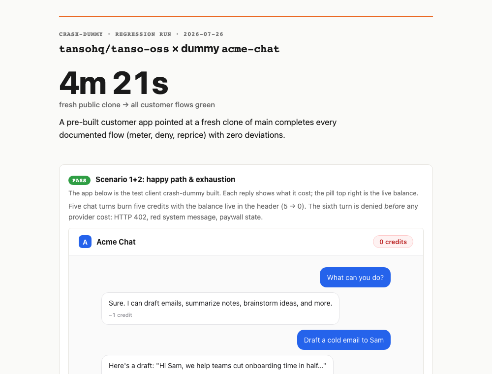

# 🚗 crash-dummy

**Take your repo for a test drive.**

It builds a test user with a real application, integrates your product the way
your docs teach, and runs the flows your customers will actually run. Every
stumble gets logged with the exact command or doc line that caused it.




## How it works

1. **Cold clone:** your public repo, fresh temp workspace, the way a stranger gets it
2. **Docs only:** reading your source is forbidden; getting stuck *is* the finding
3. **Build the dummy:** an actual application (real framework, real UI, real env config) integrating your product exactly as your docs teach
4. **Run the crash scenarios:** the happy path, the limit (quota / denial / auth), and a config change mid-flight. The unhappy paths are where products break
5. **The readout:** a beautiful self-contained `crash-report.html` (TTFS hero number, scenario cards with screenshots, findings ranked by severity) plus a grep-able markdown twin for CI

The readout above is from a real regression run against
[tanso-oss](https://github.com/tansohq/tanso-oss): all scenarios green in
**4m 21s**. An earlier cold-start run on the same repo caught an
undocumented second Docker stack at the repo root that hijacked
`docker compose up`: a bug no amount of code review would surface. Fixed the
same day. Live artifacts: [the HTML report](examples/sample-crash-report.html)
and its [markdown twin](examples/sample-crash-report.md).

## Modes

- **Cold-start** (default): builds a brand-new dummy from your docs alone and
  measures **TTFS**, time from clone to first success. Run it when docs,
  onboarding, or SDKs change.
- **Regression** (`--regression <dummy>`): dummies aren't throwaway. They
  live in a garage (`~/crash-dummies/`) and get reused. Point an existing dummy
  at a fresh stack and rerun its scenarios. Cheap enough for every release.

It tells you the estimated cost (time + tokens) before it starts driving.

- **PR mode** (`--pr <number>`): posts the readout as a comment on your PR.
  TTFS with delta vs the last run, scenario PASS/FAIL table, link to the full
  report. The crash test shows up where your team already looks.

## Install

Claude Code:

```bash
git clone https://github.com/katrinalaszlo/crash-dummy.git ~/.claude/skills/crash-dummy
```

Then: `/crash-dummy your-org/your-repo`

Any agent that reads skill files works the same. The whole skill is one
markdown file, [`SKILL.md`](SKILL.md), no dependencies.

## Safety

Hard gates ship with it: the cloned repo is treated as untrusted code,
instructions embedded in target docs are ignored and reported
(prompt-injection guard), anything hosted or billable requires one explicit
up-front consent, and only throwaway credentials ever get used.

## Share your readout

Survive a crash test and the report ends with a share block: your TTFS and
what an AI built from your docs alone. Post it. Fail one and you get a ranked
fix list instead. Either way, better you than your users.

## License

MIT
